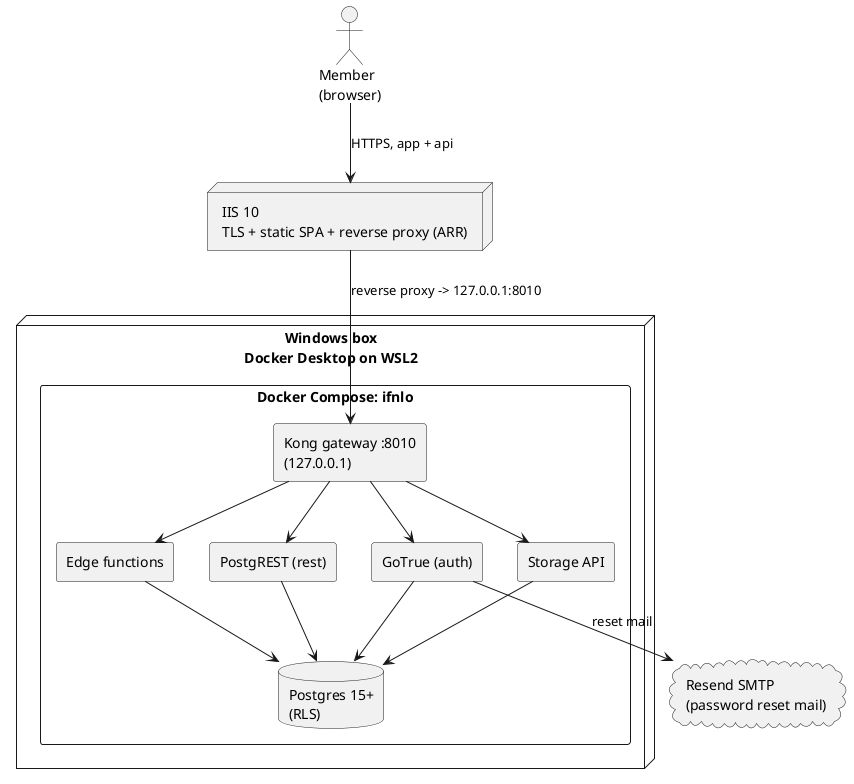

# How it all fits together

Quick mental model before you set anything up.

There are two halves:

- **Frontend**: a React app (built with Vite). It is just static files (HTML, JS, CSS) that run in the browser. In dev you run it with `npm run dev:local`.
- **Backend**: a stack of Docker containers (Supabase self-hosted). The browser talks to ONE of them, Kong, on port `8010`. Kong forwards to the auth server, the data API, storage, and the database.

The browser holds a public "anon key" and talks straight to the backend. That is fine and on purpose: the database has per-row security rules (RLS) that decide what each user can see or change. The key alone gets you nothing without a valid login.

## The containers (Docker Compose project `ifnlo`)

| Container | Job | Where you reach it |
|---|---|---|
| kong | Gateway. Everything goes through it. | `localhost:8010` |
| auth (GoTrue) | Login, password reset, sessions | through Kong, `/auth/v1` |
| rest (PostgREST) | Turns tables/functions into an API | through Kong, `/rest/v1` |
| storage | File uploads (idea attachments) | through Kong, `/storage/v1` |
| functions | Edge functions (e.g. create-member) | through Kong, `/functions/v1` |
| db | Postgres database. The real source of truth. | `localhost:5443` |
| studio | Admin dashboard (tables, SQL editor, users) | `localhost:8010` in a browser |
| mailpit | Catches outgoing email locally | `localhost:8035` |
| meta, imgproxy, realtime, supavisor | Supporting bits | internal |

## Target deployment on Windows

This is the shape you are aiming for on the Windows box. IIS handles TLS and serves the built SPA, and reverse-proxies the API calls to Kong (which only listens on localhost). Docker Desktop runs the compose stack on WSL2.

To see this diagram rendered, paste it into [plantuml.com/plantuml](https://www.plantuml.com/plantuml) or use a PlantUML extension in VS Code.

## What makes this the "login-only" build

- No public sign-up. There is no register page and no approve/decline queue. Admins create every account.
- Login and forgot-password are protected by a Cloudflare Turnstile captcha.
- New accounts get a temporary password and are forced to set their own on first login.
- Welcome and decline emails open the admin's own mail app (mailto). The only email the server actually sends is the password reset.
- LinkedIn is stored as a handle only, so a profile link can never point somewhere malicious.
